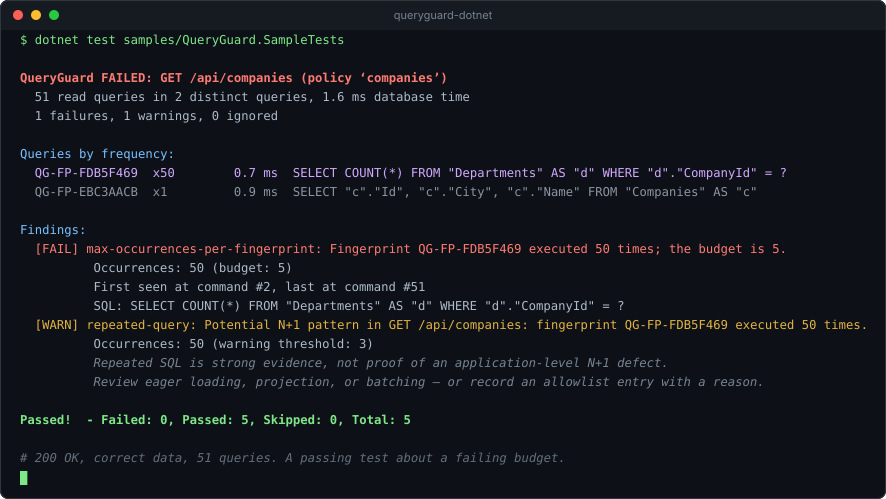

<p align="center">
  
</p>

<h1 align="center">QueryGuard.NET</h1>

<p align="center">
  <strong>Your endpoint returns 200 OK. It also ran the same query 51 times.</strong>
</p>

<p align="center">
  <a href="https://www.nuget.org/packages/QueryGuard.Testing">
    
  </a>
  <a href="https://github.com/Benziza/queryguard-dotnet/actions/workflows/ci.yml">
    
  </a>
  <a href="./LICENSE">
    
  </a>
  <a href="https://dotnet.microsoft.com/en-us/platform/support/policy">
    
  </a>
</p>

<p align="center">
  
</p>

A refactor keeps the response correct, keeps the status `200`, keeps every test green — and turns one
query into fifty. Nothing about the response says so, because tests assert *what came back*, not how
many round trips produced it.

QueryGuard counts the EF Core queries your code actually runs, groups the repeated ones, and turns that
into something a test can fail on.

> It reports repeated-query **candidates**. Repeated SQL is strong evidence of an N+1, not proof — some
> repetition is correct. Every finding says so, and every intentional exception is recorded with a
> reason instead of hidden.

## Install

```bash
dotnet add package QueryGuard.Testing --prerelease
```

One package for testing: it brings the EF Core interceptor with it. Add `QueryGuard.AspNetCore` if you
also want per-request reports from a running app, and `QueryGuard.Reporting` for JSON, JUnit, or
Markdown output.

*The one-line setup below needs `0.1.0-preview.2` or later. On `0.1.0-preview.1` you construct the
interceptor by hand — see [configuration](./docs/configuration/README.md).*

## Use it

Two lines of setup. Attach QueryGuard where the context is configured:

```csharp
options.UseSqlite(connectionString).UseQueryGuard();
```

Then assert:

```csharp
await using var scope = QueryGuardScope.Start(
    "GET /api/companies",
    QueryGuardPolicy.Create("companies").WithMaxOccurrencesPerFingerprint(5));

await client.GetAsync("/api/companies");

QueryGuardAssert.Passes(await scope.CompleteAsync());
```

That is the whole API for the common case. No interceptor to construct, no session accessor to match
up. Outside a scope nothing is captured, so leaving the call in place costs about a nanosecond per
command and no allocation.

`QueryGuard.Testing` references no test framework, so xUnit, NUnit, MSTest, and TUnit all work
unchanged.

## What a failure tells you

```text
QueryGuard FAILED: GET /api/companies (policy 'companies')
  51 read queries in 2 distinct queries

  [FAIL] max-occurrences-per-fingerprint: QG-FP-FDB5F469 executed 50 times; the budget is 5.
          SQL: SELECT COUNT(*) FROM "Departments" AS "d" WHERE "d"."CompanyId" = ?
```

Try it in three minutes — `git clone`, then:

```bash
dotnet test samples/QueryGuard.SampleTests
```

The sample has the broken endpoint, the same endpoint fixed with a projection, a test asserting both
return identical data, and an *intentional* repetition that is reported as ignored with its reason.
See [`samples/`](./samples/).

## Or skip picking a number entirely

`WithMaxOccurrencesPerFingerprint(5)` needs someone to know that five is right. On an endpoint nobody
has measured, nobody does.

So record what it costs today and report what changed:

| Scope | Before | Now | Change |
| --- | --: | --: | --- |
| `GET /api/companies` | 3 | 51 | +48, most-repeated query +48 |
| `GET /api/orders` | 8 | 8 | most-repeated query +7 |
| `GET /api/users` | 4 | 4 | unchanged |
| `GET /api/reports` | 12 | 3 | -9 (improved) |

No threshold to guess, and `3 → 51` needs no explanation. The `orders` row is the one worth a second
look: the read count did not move, but one query is now running seven more of them — which a
total-count budget cannot see.

The baseline is a small JSON file you commit, so accepting a regression means regenerating it and
letting the diff record the decision. Wire the table into `$GITHUB_STEP_SUMMARY` and it lands on the
workflow run page. See [baselines](./docs/baselines/README.md).

## Why not just count total queries?

Because twenty legitimate queries can hide one query pattern repeating fifteen times. A total-count
budget stays satisfied while the thing you care about gets worse. QueryGuard budgets individual SQL
fingerprints too, and tracks them separately in a baseline for the same reason.

## What it does not do

- **It does not prove an N+1.** All it knows is that the same normalized SQL ran N times. Some
  repetition is correct, which is why findings say *candidate* and why every allowlist entry needs a
  written reason.
- **EF Core only.** Dapper and raw ADO.NET are invisible to it — it hooks EF Core's official
  `DbCommandInterceptor`.
- **No execution plans, no profiler UI, no hosted service.** It counts queries and groups SQL.
- **It will not fix your code.** No automatic `Include`, no rewritten LINQ.
- **Three providers are integration-tested** in CI — SQLite, PostgreSQL, and SQL Server. Others work
  through the same contract, but their fingerprint *quality* is unverified; see
  [provider support](./docs/providers/README.md).
- **.NET 8 and .NET 10.** .NET 9 is skipped on purpose ([ADR-0008](./docs/decisions/0008-target-frameworks.md)).
- **Preview.** The API will change before `1.0.0`. The report JSON carries a `schemaVersion` so a
  breaking change to it is a visible event.

Profilers and APM answer *what is slow in production?* QueryGuard answers *did this change alter how
many queries we run?* — before merge, as a build failure. They compose fine; keep your APM.

## Privacy

It reads SQL, so the defaults are the contract: no parameter values, no connection strings, no stack
traces, nothing written into HTTP responses. Redaction runs centrally before any reporter sees a string,
so no reporter — including one you write — can leak what was never captured. Each of those has a test
([ADR-0004](./docs/decisions/0004-parameter-privacy.md)).

## Documentation

| | |
| --- | --- |
| [How it works](./docs/concepts/README.md) | Sessions, fingerprints, redaction, analysis |
| [Configuration](./docs/configuration/README.md) | Every budget and option, and why each default is what it is |
| [Baselines](./docs/baselines/README.md) | Recording what a scope costs and reporting what changed |
| [Troubleshooting](./docs/troubleshooting/README.md) | Nothing recorded, fingerprints not grouping, middleware ordering |
| [When a finding is wrong](./docs/troubleshooting/false-positives.md) | The allowlist workflow, end to end |
| [Benchmarks](./docs/benchmarks.md) | What it costs, with raw output |
| [Decision records](./docs/decisions/README.md) | Why it behaves the way it does |

## Contributing

Issues and focused pull requests welcome — three questions on the PR template, and small fixes need
nothing more. Start with [CONTRIBUTING.md](./CONTRIBUTING.md).

The most valuable report right now is a **false positive**: a repeated query QueryGuard flagged that
was correct. That is the failure mode that decides whether a tool like this is worth keeping, and
accepted reports become regression fixtures.

Design questions are open in
[Discussion #80](https://github.com/Benziza/queryguard-dotnet/discussions/80) — the primary guard,
allowlist brittleness, and where this belongs in the lifecycle. Security issues go to
[SECURITY.md](./SECURITY.md).

## License

MIT. Borrowed its product lesson from [Bullet](https://github.com/flyerhzm/bullet) for Rails: make
hidden query behaviour visible during development and tests. The implementation is independent, built
on EF Core's public interception API.
